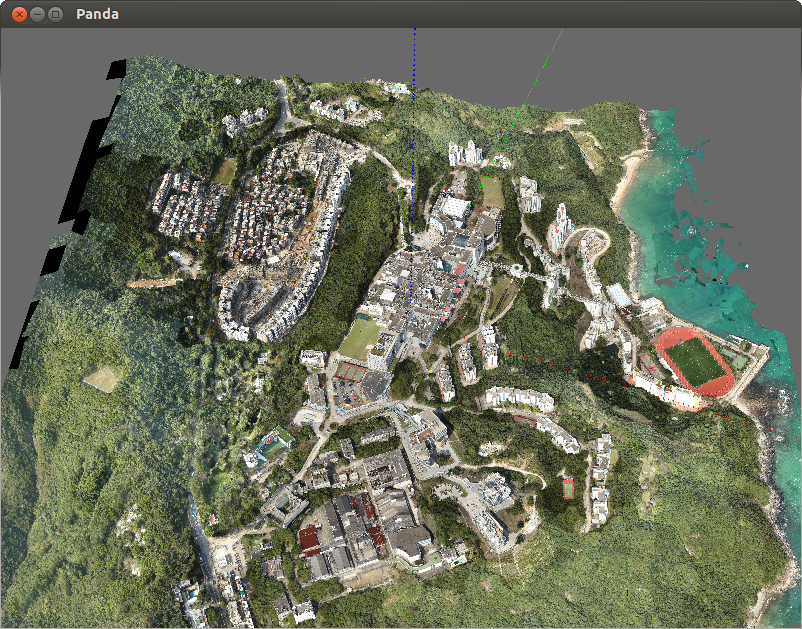
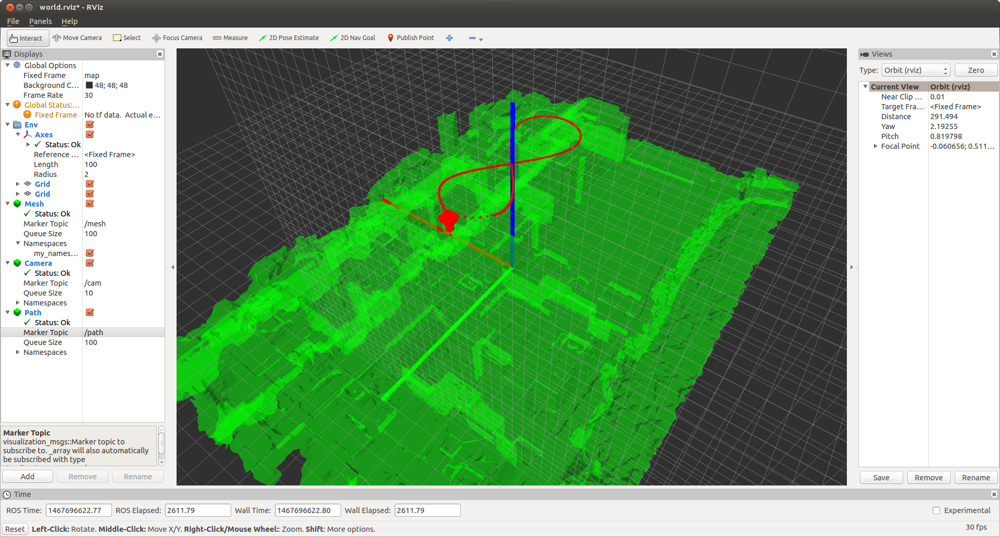

# Monte-Carlo MapNet
### Manohar Kuse <mpkuse@connect.ust.hk>

Trains a MapNet with Monte-Carlo process on a 3D model
With intensity perfurbation, possible to have augmented features for training.

Remake of the original `mc_train`. More organized code and trying to run on the larger 3D model

Manohar Kuse, Sunil Prasad Jaiswal, Shaojie Shen, **Deep-mapnets: A Residual Network for 3D Environment Representation **
2017 IEEE International Conference on Image Processing (ICIP 2017), Beijing, China, 17-20 September 2017

## Prerequistite Packages
- Caffe
- Panda3d
- OpenCV
- Numpy

## Rendering from 3D model
The 3D model depected below is available for download from [here](https://hkustconnect-my.sharepoint.com/:u:/g/personal/mpkuse_connect_ust_hk/EaC-iCvxQ35PvDjuzduiaoYBrKP6VRFEQm5as90rlEJY2A?e=EYDyDe) (4.2 GB).
It is a model of HKUST, Hong Kong (GPS-lat:22.335162 GPS-long:114.263035)

If you use our model for training, do site us. The model was created with Altizure.

